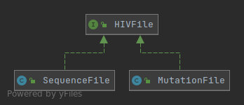
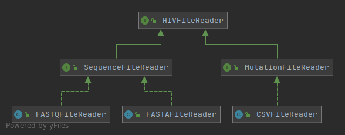

# Aufgabe zu Woche 5

In dieser Woche kommt eine der häufigsten Aufgaben in der Programmierung auf Sie zu: Refactoring. Das bedeutet, Sie strukturieren Ihren Code neu - alles sieht danach anders aus, aber viele der Veränderungen sind einfach nur Neuorganisation (na ja, ein bisschen was implementieren Sie auch neu, wir wollen ja vorankommen, aber der Großteil der Arbeit ist refactoring).

Damit Sie die ganzen Strukturen selber hinschreiben, habe ich Ihnen diesmal nicht alle geforderten Klassen und Interfaces direkt vorgelegt. Entsprechend werden die Tests zunächst gar nicht laufen - sie gehen natürlich von der fertigen Codestruktur aus. Ich empfehle Ihnen entsprechend, zunächst die Klassen/Interfaces/Methoden alle nur zu deklarieren (bei Methoden gerne einfach nur "return false;" o.Ä.), bis die Gesamtstruktur stimmt und die Tests keine Syntaxfehler mehr aufweisen. Dann können Sie sich der Implementation der Logik und dem Verschieben von existierendem Code zuwenden.

## Eine unerwartete Wendung

Nachdem Sie mit dem Entwickeln des Tools begonnen haben, kommen die Auftraggeber zu Ihnen und bringen - wie es so häufig passiert - eine Änderung ein: Die Patientensequenzen können nicht nur im FASTA-Format, sondern auch im FASTQ-Format vorliegen. Dieses ist ähnlich wie das FASTA-Format aufgebaut, nur dass noch Qualitätsinformationen für jede Base vorhanden sind:

```text
@Sequenzname
GATTTGGGGTTCAAAGCAGTATCGATCAAATAGTAAATCCATTTGTTCAACTCACAGTTT
+
!''*((((***+))%%%++)(%%%%).1***-+*''))**55CCF>>>>>>CCCCCCC65
@Sequenzname 2
GATTTGGGGTTCAAAGCAGTATCGATCAAATAGTAAATCCATTTGTTCAACTCACAGTTT
+
**CCC*+))!''*(%%++(***)%)(%%>>+**5>>%%).1***-5''))*CCF>>CCCC
```

Der Sequenzhaeder beginnt nun nicht mehr mit ```>``` sondern mit ```@```. Zudem ist nun nicht mehr nur eine Aminosäuresequenz vorhanden, sondern nach der Sequenzinformation kommt eine Trennzeile, die mit ```+``` beginnt (optional kann nach dem ```+``` nochmal der Sequenzname wiederholt werden), und danach kommt eine weitere Sequenz, die für jede Base aus der Aminosäuresequenz eine Qualität angibt. Diese Informationen werden nicht für die folgenden Analysen benötigt, können also verworfen werden (zum Hintergrund: je nach Variante des FASTQ-Formats wird, um die Qualität zu berechnen, ein offset von dem ASCII-Wert der Qualität abgezogen, um auf einen Qualitätswert von 0-64 zu kommen, der die Fehlerwahrscheinlichkeit der jeweiligen Base bezeichnet).

## Die Reaktion

Das bedeutet refactoring - Sie müssen Ihren existierenden Code an die neuen Anforderungen anpassen. Um die Arbeit im Fall von weiteren solchen Überraschungen zu vereinfachen, entscheiden Sie sich, direkt eine neue Abstraktionsebene in Ihren Code einzuführen:

### Files

Erstellen Sie zunächst in dem neuen package ```org.htw.prog2.aufgabe1.files``` neue Klassen für für die unterschiedlichen möglichen Dateien. Das bräuchten Sie zwar nicht für den einen Dateityp, aber Sie vermuten, dass da noch mehr Veränderungen eingebracht werden könnten, also nehmen Sie die Mutationspattern auch direkt in das refactoring auf:

* Ein Interface ```HIVFile```. Dieses Interface definiert keine Methoden, es handelt sich um das Marker Interface-Pattern - es erlaubt uns, in den nächsten Schritten zu klarifizieren, mit welchen Klassen wir es zu tun haben.
* Eine Klasse ```SequenceFile```, die die Informationen eines Sequenz-files halten wird und die von ```HIVFile``` ableitet. Sie soll neben einem leeren Constructor die folgenden Methoden (z.T. refaktorisiert aus ```SeqFile``` der letzten Woche) enthalten:
    * ```public addSequence(String sequence)```: Fügt eine neue Sequenz der Sequenzliste hinzu
    * ```public HashSet<String> getSequences()```: Gibt die gespeicherten Sequenzen zurück
    * ```public String getFirstSequence()```: Gibt die erste hinzugefügte Sequenz zurück
    * ```public int getNumberOfSequences()```: Gibt die Anzahl der gespeicherten Sequenzen zurück
* Eine Klasse ```MutationFile```, die die Informationen eines Mutations-files halten wird und die von ```HIVFile``` ableitet. Sie soll neben einem leeren Constructor die folgenden Methoden (z.T. refaktorisiert aus ```MutationPatterns``` der letzten Woche) enthalten:
    * ```public void addDrug(String drug)```: Fügt der Liste der gespeicherten Medikamente einen neuen Medikamentennamen hinzu
    * ```public LinkedList<String> getDrugs()```: Gibt die gespeicherten Medikamentnamen zurück
    * ```public void addMutation(Mutation variant)```: Fügt zur Liste der gespeicherten Mutationen eine neue Mutation hinzu
    * ```public LinkedList<Mutation> getMutations()```: Gibt die gespeicherten Mutationen zurück
    * ```public int getNumberOfMutations()```: Gibt die Anzahl der gespeicherten Mutationen zurück
    
Es ergibt sich das folgende Vererbungsschema zwischen den Dateien:



Implementieren Sie zudem, um Mutationsmuster in ```MutationFile``` zu speichern, eine Klasse ```Mutation``` mit den folgenden Methoden:
* ```public Mutation(String variant, HashMap<String, Double> resistances)```: Constructor, der eine Variantendefinition (siehe erste Woche, z.B. "9M") sowie eine Hashmap mit einer Beschreibung der Auswirkungen (key: Name des Medikaments als String, value: Veränderung der Wirksamkeit dieses Medimakents) nimmt.
* ```public String getVariant()```: Getter für die Variante
* ```public HashMap<String, Double> getResistances()```: Getter für die Resistenzen 

### Readers

Implementieren Sie nun, um die einfache Erweiterbarkeit der einlesbaren Dateitypen sicherzustellen, in dem neuen package ```org.htw.prog2.aufgabe1.readers``` entsprechende neue Klassen. Dabei beginnen Sie mit dem Interface ```HIVFileReader```, das die folgenden beiden Methoden definiert:
* ```public HIVFile readFile(String filename) throws IOException, FileFormatException```: Diese Methode soll die übergebene Datei einlesen und wie ```SequenceFile``` Exceptions werfen, wenn die Datei fehlt oder das Format falsch ist.
* ```public boolean canReadFile(String filename)```: Gibt true zurück, wenn die Datei von diesem Reader (basierend auf einem ersten "Reingucken") gelesen werden kann, sonst false. 

Von dieser Klasse sollen die Interfaces für das Einlesen von Sequenz- und Mutationsfiles ableiten, ```SequenceFileReader``` und ```MutationFileReader```. Dabei soll jeweils nur die Methode ```readFile(String filename)``` überschrieben werden, und zwar so, dass sie im Fall von ```SequenceFileReader``` ein ```SequenceFile``` zurückgibt und im Fall von ```MutationFileReader``` ein ```MutationFile```.

Implementieren sie schlussendlich die Klassen ```FASTAFileReader``` und ```FASTQFileReader``` (implementieren das Interface ```SequenceFileReader```, ```FASTAFileReader``` ist eine Refaktorisierung der alten Einlesemethoden in ```SequenceFile``` der letzten Woche, ```FASTQFileReader``` implementiert die neue Logik zum Einlesen von FASTQ-Dateien) sowie die Klasse ```CSVFileReader``` (implementiert das Interface ```MutationFileReader```, ist eine Refaktorisierung der Einlesemethoden aus ```MutationPatterns``` aus der letzten Woche).

Es ergibt sich das folgende Vererbungsschema:



### One class to rule them all: ReaderManager

Implementieren Sie, um eine Liste von Readern zu verwalten und für eine Datei den richtigen aus dieser Liste auszuwählen, eine Klasse ReaderManager. Diese soll unterschiedliche Reader verwalten können, die aber alle ```HIVFileReader``` implementieren müssen - implementieren Sie sie also als typisierte Klasse mit dem Typ ```<T extends HIVFileReader>```.

Implementieren Sie in ReaderManager die folgenden Methoden:
* ```public void addReader(T reader)```: Fügt der Liste der bekannten Reader einen neuen Reader hinzu
* ```public T getReaderForFile(String filename) throws NoValidReadersException```: Findet in der Liste der hinzugefügten Reader einen, der die Datei ```filename``` einlesen kann (denken Sie an die Methode ```canReadFile(String filename)```, die von ```HIVFileReader``` vorgeschrieben wird) und gibt diesen Reader zurück. Falls kein passender Reader gefunden werden konnte, wird eine ```org.htw.prog2.aufgabe1.exceptions.NoValidReadersException``` geworfen.

Da die Verwendung nicht ganz offensichtlich ist, ist die ```main()``` in ```HIVDiagnostics``` schon implementiert. Hier eine kurze Beschreibung der Idee bei der Verwendung einer solchen Struktur.

Zunächst wird für einen einzulesenden Dateityp - hier ein SequenceFile - ein ReaderManager erstellt und die bekannten SequenceFileReader werden hinzugefügt:

```java
ReaderManager<SequenceFileReader> sequenceReaderManager = new ReaderManager<>();
sequenceReaderManager.addReader(new FASTAFileReader());
sequenceReaderManager.addReader(new FASTQFileReader());
```

Wenn dann eine Datei mit Sequenzinformationen eingelesen werden soll, kann einfach der ReaderManager aufgefordert werden, den richtigen Reader dafür zu finden:

```java
SequenceFileReader sequenceReader = sequenceReaderManager.getReaderForFile(referenceFileName);
```

Dieser kann dann verwendet werden, um die Datei einzulesen:

```java
SequenceFile referencefile = sequenceReader.readFile(referenceFileName);
```

Sollte nun beispielsweise die Anforderung auftauchen, dass zusätzlich auch GenBank-Files Sequeninformationen eingelesen werden können müssen, muss nur ein entsprechender ```SequenceFileReader``` (z.B. ```GenBankFileReader```) implementiert werden und dem ReaderManager hinzugefügt werden:

```java
sequenceReaderManager.addReader(new GenBankFileReader());
```

Diese Veränderungen berühren in keiner Weise sonstigen Code - durch die eingeführten Abstraktionsebenen ist es späterem Code vollkommen egal, welche SequenceReader der ReaderManager alle kennt, und auch wo das gelesene SequenceFile eigentlich herkam. Erweiterungen um neue unterstützte Dateitypen werden entsprechend trivial.
